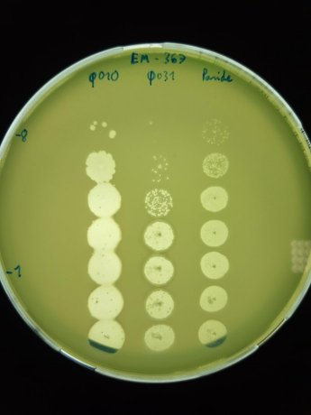
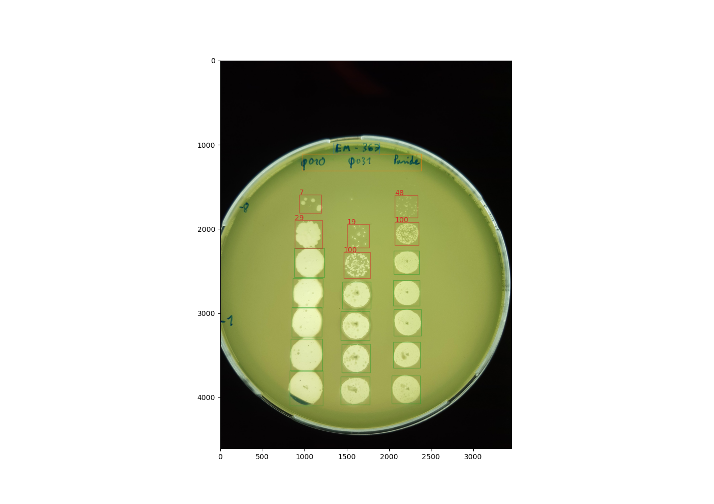

# PFU_counter
Test to count phages on agar plates. The idea is to give picture of an agar plate as input (taken by a phone), and return the dilution values in a table format.

## Pipeline
### Plate element detection
We input the raw picture of the agar plate and use a FasterRCNN network (mobilenet backbone) to detect the different elements of the plate. The elements are:
 - The plate name (usually the bacteria used). It's at the top of the plate.
 - The phage names (written below the plate name). They correspond to the different columns.
 - All the spots on the plate. They are dilution droplets that the experimentalist put on the agar.

### Plate element cleaning
From the above results, a hand made script would separate the dilution spots into column (for each phages) and rows (for dilution level).
Once this is made, it would select the dilution spots where you can actually count single colonies, extract them and give them as input for the next part of the pipeline.

### Colony counting
Here we use the single dilution spot as input. They are small images extracted from the original image. This is the input for the second deep learning network.
This network counts the number of colonies in the image and returns it.
Using the information of the dilution level and the phage column extracted previously, we can then attribute a concentration to the dilution for the given phage.
This is what would be given as an output of the pipeline for each phage (in a table).

### Additional steps that could be useful
Use some OCR to transform the image of the plate name and phage names into real characters, so that we could put that into the table.
This would be nice, but I don't think it is essential.

### Graphical result
The idea is to go from the raw image:

To the following results:

## Current state

The files that correspond to newest iterations are in the `scripts/` folder.

### Plate_analyzer.py
This is the code that puts all the parts together.

### detector.py
This is the file I use to create and train the plate element detection network. It's a FasterRCNN network with a mobilenet backbone.

### counter.py
This is the file I use to create and train the colony counting network. It also uses a FasterRCNN network with a mobilenet backbone.

### Other files
All the other files are either helper functions (dataset creation, dataset loading, image augmentation etc...) or old prototypes for parts of the pipeline.
